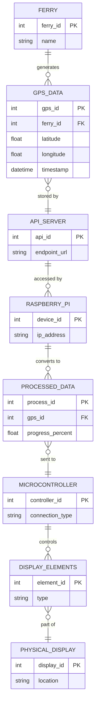

```mermaid
erDiagram
    FERRY {
        int ferry_id PK
        string name
    }
    GPS_DATA {
        int gps_id PK
        int ferry_id FK
        float latitude
        float longitude
        datetime timestamp
    }
    API_SERVER {
        int api_id PK
        string endpoint_url
    }
    FERRY ||--o{ GPS_DATA : "generates"
    GPS_DATA }o--|| API_SERVER : "stored by"
    RASPBERRY_PI {
        int device_id PK
        string ip_address
    }
    PROCESSED_DATA {
        int process_id PK
        int gps_id FK
        float progress_percent
    }
    API_SERVER ||--o{ RASPBERRY_PI : "accessed by"
    RASPBERRY_PI ||--o{ PROCESSED_DATA : "converts to"
    MICROCONTROLLER {
        int controller_id PK
        string connection_type
    }
    DISPLAY_ELEMENTS {
        int element_id PK
        string type
    }
    PHYSICAL_DISPLAY {
        int display_id PK
        string location
    }
    PROCESSED_DATA }o--|| MICROCONTROLLER : "sent to"
    MICROCONTROLLER ||--o{ DISPLAY_ELEMENTS : "controls"
    DISPLAY_ELEMENTS }o--|| PHYSICAL_DISPLAY : "part of"
```
