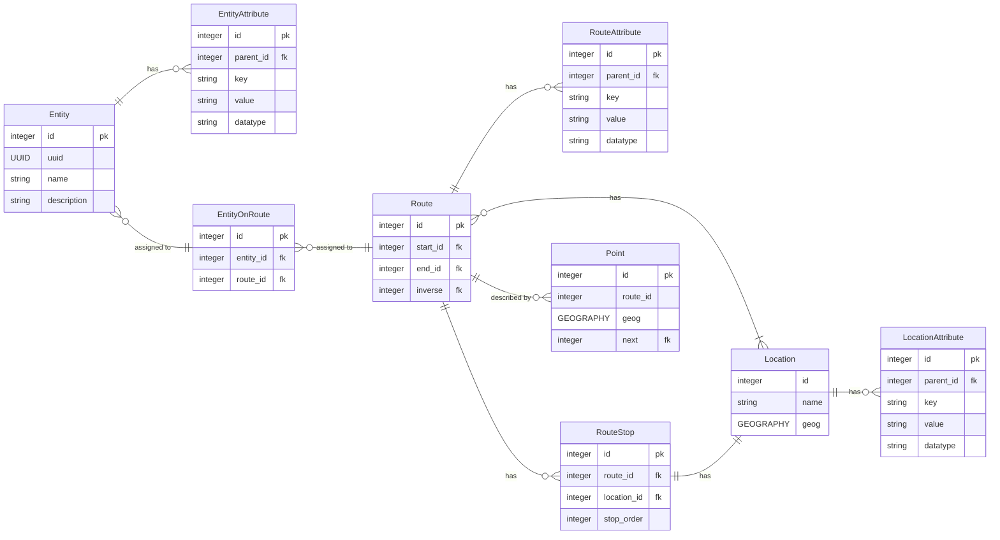

```mermaid
erDiagram
    direction LR
    Entity {
        integer id pk
        UUID uuid
        string name
        string description
    }

    EntityAttribute {
        integer id pk
        integer parent_id fk
        string key
        string value
        string datatype
    }

    EntityOnRoute {
        integer id pk
        integer entity_id fk
        integer route_id fk
    }

    Route {
        integer id pk
        integer start_id fk
        integer end_id fk
        integer inverse fk
    }

    RouteAttribute {
        integer id pk
        integer parent_id fk
        string key
        string value
        string datatype
    }

    RouteStop {
        integer id pk
        integer route_id fk
        integer location_id fk
        integer stop_order
    }

    Location {
        integer id
        string name
        GEOGRAPHY geog
    }

    LocationAttribute {
        integer id pk
        integer parent_id fk
        string key
        string value
        string datatype
    }

    Point {
        integer id pk
        integer route_id
        GEOGRAPHY geog
        integer next fk
    }

    Entity }o--|| EntityOnRoute : "assigned to"
    EntityOnRoute }o--|| Route : "assigned to"
    Entity ||--o{ EntityAttribute : has

    Location ||--o{ LocationAttribute : has

    Route }o--|{ Location : has
    Route ||--o{ RouteStop : has
    RouteStop ||--|| Location : has
    Route ||--o{ Point : "described by"
    Route ||--o{ RouteAttribute : has
```