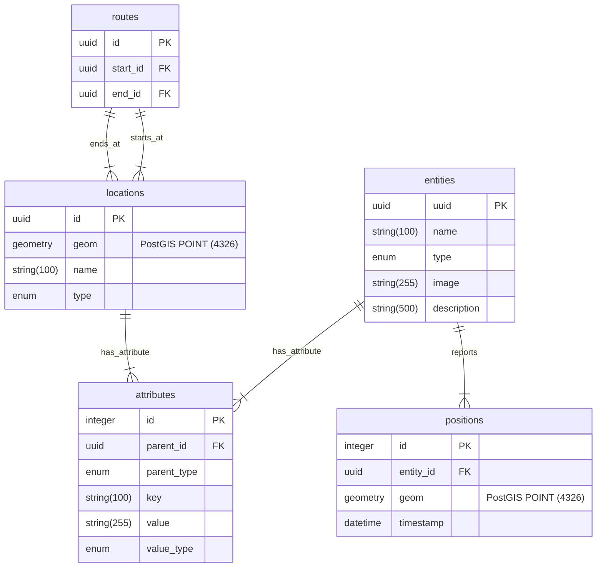

```mermaid
erDiagram
    entities ||--|{ attributes : has_attribute
    locations ||--|{ attributes : has_attribute

    entities ||--|{ positions : reports
    
    routes ||--|{ locations : starts_at
    routes ||--|{ locations : ends_at
    
    entities {
        uuid uuid PK
        string(100) name
        enum type
        string(255) image 
        string(500) description 
    }
    attributes {
        integer id PK
        uuid parent_id FK
        enum parent_type
        string(100) key
        string(255) value
        enum value_type
    }
    positions {
        integer id PK
        uuid entity_id FK
        geometry geom "PostGIS POINT (4326)"
        datetime timestamp
    }
    locations {
        uuid id PK
        geometry geom "PostGIS POINT (4326)"
        string(100) name
        enum type
    }
    routes {
        uuid id PK
        uuid start_id FK
        uuid end_id FK
    }

```